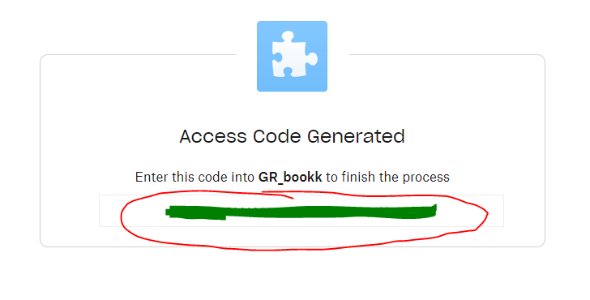

The app creates a GUI for the user on windows machine.

As input it uses:
- monthly transactions data downloaded from the finnish OP bank in .csv format
- .xlsx table with companies transactions data for previous months

The .csv input data is processed to extract the needed data to display in the table in GUI. 
The input from the user eg. vat ammounts or transaction codes are used to complement the input .csv file and update the .xlsx table with the new month transactions data.

In the GUI the login requires user connection to dropbox cloud service where temporary .csv files are stored. It allows several users work with the same data and allows to continue interrupted work at any time.
The login GUI windwos allows the user to copy the oauth 2.0 link and paste the code obtained.

The actual GR_book GUI interface allows the user to choose VAT percent ammount 24% or 0% and to choose the standard bookkeeping code for each transaction. For more complicated cases to leave the values to be entered manually. 

